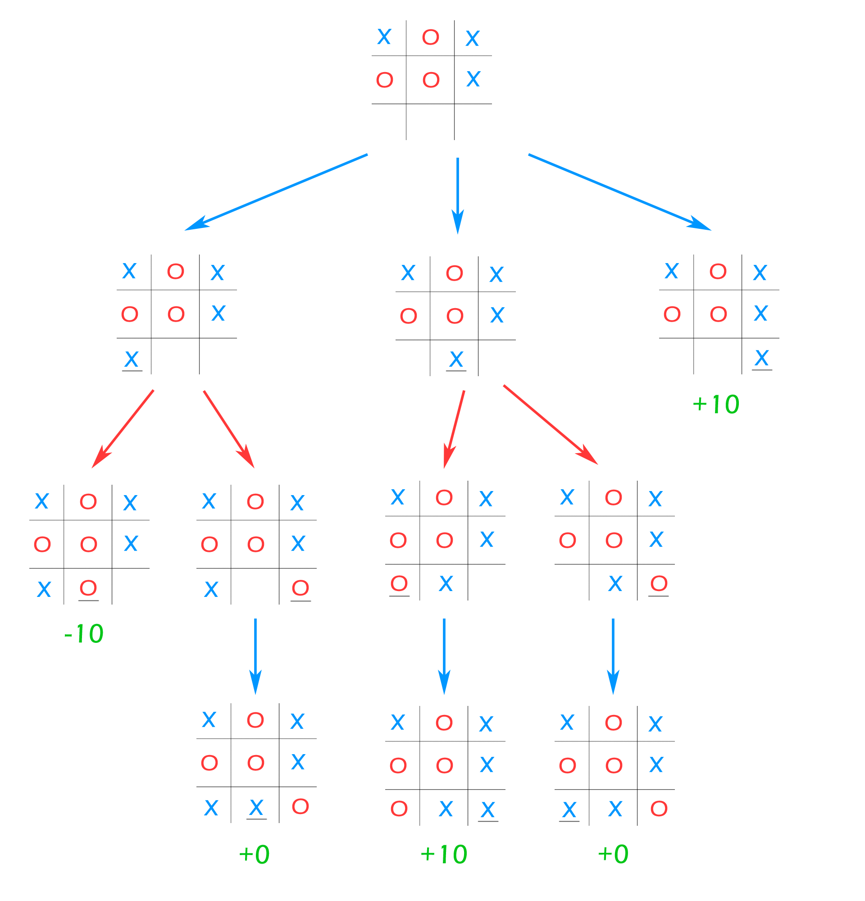

# About the project


This is a final project for the course "Foundations of Softwre Engeneering" at Skoltech.

# Contributions
Contributions to the project involve expanding capabilities within the utils.cpp file, making cmake build system and implemeting code as a Docker container.


# Quickstart: 
Build the project:
```bash
docker build -t project_cpp .
```

Test the software
```bash
docker run --rm -i project_cpp bash scripts/test.sh
```

Run
```bash
docker run --rm -i project_cpp bash scripts/run.sh
```

Please be aware, that sometimes `docker` requires admin rights, so use `sudo`.

# Reproducability in empty container

Empty container with `ubuntu:23.04` requres up-to-date `git`, `cmake` and `g++`. You could install it with

```bash
apt upgrade
apt install git cmake make g++
```

Then you need to run scripts to build dependancies and test software:

```bash
chmod +x scripts/prereqs.sh
./scripts/prereqs.sh

chmod +x scripts/build.sh
./scripts/build.sh

chmod +x scripts/test.sh
./scripts/test.sh
```

And, finally run:

```bash
chmod +x scripts/run.sh
./scripts/run.sh
```

# Tic-Tac-Toe AI

A tic-tac-toe AI program that never loses. This program uses the minimax algorithm with alpha-beta pruning to reduce the search space.

https://en.wikipedia.org/wiki/Minimax#Minimax_algorithm_with_alternate_moves

## Algorithm Details
A **minimax** algorithm is a recursive algorithm for choosing the next move in an n-player game, usually a two-player, back and forth game. A value is associated with each position or state of the game. This value is computed by means of a position evaluation function and it indicates how good it would be for a player to reach that position. The player then makes the move that maximizes the minimum value of the position resulting from the opponent's possible following moves. If it is A's turn to move, A gives a value to each of his legal moves.

A simple version of the minimax algorithm, stated below, deals with games such as tic-tac-toe, where each player can win, lose, or draw. If player A can win in one move, his best move is that winning move. If player B knows that one move will lead to the situation where player A can win in one move, while another move will lead to the situation where player A can, at best, draw, then player B's best move is the one leading to a draw. Late in the game, it's easy to see what the "best" move is. The Minimax algorithm helps find the best move, by working backwards from the end of the game. At each step it assumes that player A is trying to maximize the chances of A winning, while on the next turn player B is trying to minimize the chances of A winning (i.e., to maximize B's own chances of winning).

**Alpha–beta** pruning is a search algorithm that seeks to decrease the number of nodes that are evaluated by the minimax algorithm in its search tree. This allows us to search much faster and even go into deeper levels in the game tree. It cuts off branches in the game tree which need not be searched because there already exists a better move available. The algorithm maintains two values, alpha and beta, which represent the maximum score that the maximizing player is assured of and the minimum score that the minimizing player is assured of respectively. Initially alpha is negative infinity and beta is positive infinity, i.e. both players start with their lowest possible score. It can happen that when choosing a certain branch of a certain node the minimum score that the minimizing player is assured of becomes less than the maximum score that the maximizing player is assured of (beta <= alpha). If this is the case, the parent node should not choose this node, because it will make the score for the parent node worse. Therefore, the other branches of the node do not have to be explored.

## Pseudocode
~~~~
function minimax(node, depth, isMaximizingPlayer, alpha, beta):

    if node is a leaf node :
        return value of the node
    
    if isMaximizingPlayer :
        bestVal = -INFINITY 
        for each child node :
            value = minimax(node, depth+1, false, alpha, beta)
            bestVal = max( bestVal, value) 
            alpha = max( alpha, bestVal)
            if beta <= alpha:
                break
        return bestVal

    else :
        bestVal = +INFINITY 
        for each child node :
            value = minimax(node, depth+1, true, alpha, beta)
            bestVal = min( bestVal, value) 
            beta = min( beta, bestVal)
            if beta <= alpha:
                break
        return bestVal
        
// Calling the function for the first time.
minimax(0, 0, true, -INFINITY, +INFINITY)
~~~~

## Minimax Algorithm Visualisation


# Documentation

### Print Board Function:
The print_board function is responsible for displaying the current state of the tic-tac-toe game board.
It takes a 3x3 grid represented by a 2D array called board as an argument.
This function visually renders the game board on the console, showing the positions of each element in a grid format.
It uses "X" and "O" to represent player markers and empty spaces, creating the appearance of a tic-tac-toe board.


### Get Legal Moves Function:
The get_legal_moves function is designed to determine all the available legal moves (empty spaces) on the tic-tac-toe board.
Like the print_board function, it also takes the game board board as an argument.
It returns a vector of pairs, where each pair represents the row and column indices of an available move.
This function is used to identify and retrieve all the positions where a player can make their next move, assisting in game logic.


### Position Occupied Function:
The position_occupied function checks if a specified position on the tic-tac-toe board is already occupied.
It takes the game board board and a pair of row and column indices pos as input.
This function first retrieves all the legal moves (empty positions) on the board using the get_legal_moves function.
It then compares the specified position with the list of legal moves and returns false if the position is in the list of legal moves (i.e., it's not occupied), otherwise, it returns true (i.e., it's occupied).


### Get Occupied Positions Function:
The get_occupied_positions function finds and returns all board positions occupied by a given marker (e.g., 'X' or 'O').
It takes the game board board and the marker character marker as input.
The function iterates through the entire board, identifying and storing the row and column indices of positions marked with the specified marker.
It returns a vector of pairs, each representing the row and column indices of an occupied position.


### Board Is Full Function:
The board_is_full function checks if the tic-tac-toe board is completely filled with player markers, indicating a full game board.
It takes the game board board as input.
The function uses the get_legal_moves function to obtain the list of legal moves (empty spaces) on the board.
If there are no legal moves (i.e., the board is full), it returns true; otherwise, it returns false.


### Game Is Won Function:
The game_is_won function checks if the game has been won by a player by examining the occupied positions on the board.
It takes a vector of pairs occupied_positions as input, representing the positions marked by the players.
The function checks if any of the predefined winning states (e.g., three in a row, column, or diagonal) match the occupied positions.
If a winning state is found, it returns true, indicating that the game has been won; otherwise, it returns false.


### Get Opponent Marker Function:
The get_opponent_marker function determines the opponent's marker in the tic-tac-toe game.
It takes the current player's marker as input.
If the current player's marker is PLAYER_MARKER, it returns AI_MARKER, and if the current player's marker is AI_MARKER, it returns PLAYER_MARKER.


### Get Board State Function:
The get_board_state function assesses the current state of the tic-tac-toe game, such as whether someone has won, lost, or if the game has ended in a draw.
It takes the game board board and the current player's marker as input.
The function first calculates the opponent's marker using the get_opponent_marker function.
It then checks if the current player has won the game using the game_is_won function, returning WIN if they have.
It also checks if the opponent has won the game, returning LOSS if they have.
If neither player has won, it checks if the game board is full, returning DRAW if it is.
If none of the above conditions are met, it also returns DRAW by default.


### Minimax Optimization Function:
The minimax_optimization function applies the minimax algorithm to optimize the AI's moves in the game.
It takes the game board board, the current player's marker, the depth of the search, and alpha-beta pruning values as input.
The function determines the best move for the AI by recursively exploring possible moves and their outcomes.
It returns a pair, where the first element is the score associated with the move, and the second element is the best move itself.


### Game Is Done Function:
The game_is_done function checks if the tic-tac-toe game has finished, which includes scenarios of a full board or a win by either player.
It takes the game board board as input.
If the board is full, it returns true.
If the AI has won (indicated by DRAW != get_board_state(board, AI_MARKER)), it also returns true. Otherwise, it returns false.
